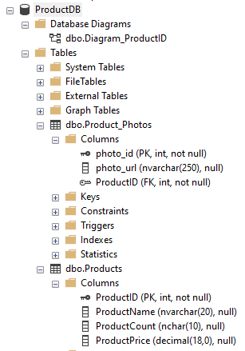
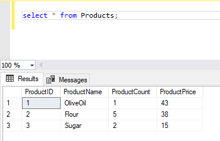
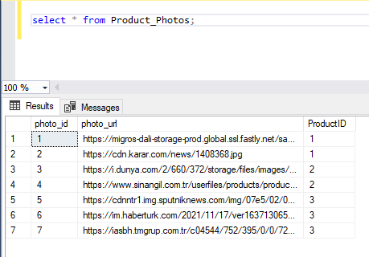
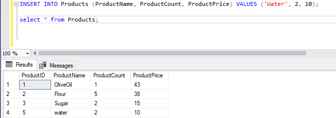
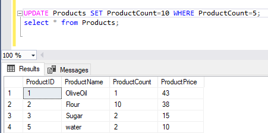
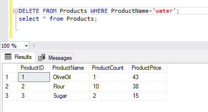
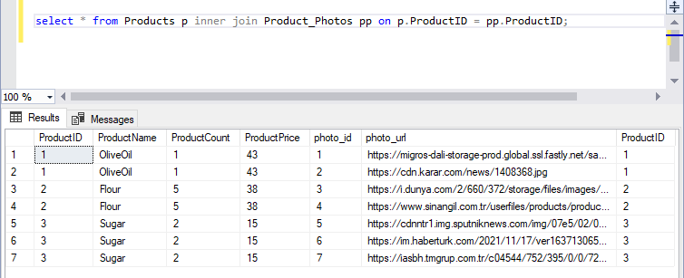
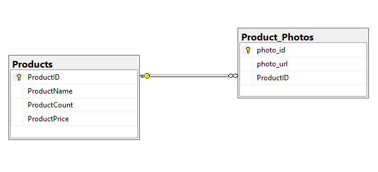

#### Create Sql Database and Tables
- Create Database 
- Select Two Tables (Products and Product_Photos)
- Join Operations

### Create Database 

##### Select Products Table 

##### Select Product_Photos Table 

##### Insert Product 

##### Update Product

##### Delete Product

##### JOIN (Products and Product_Photos)

#### DIAGRAM (Products and Product_Photos)

